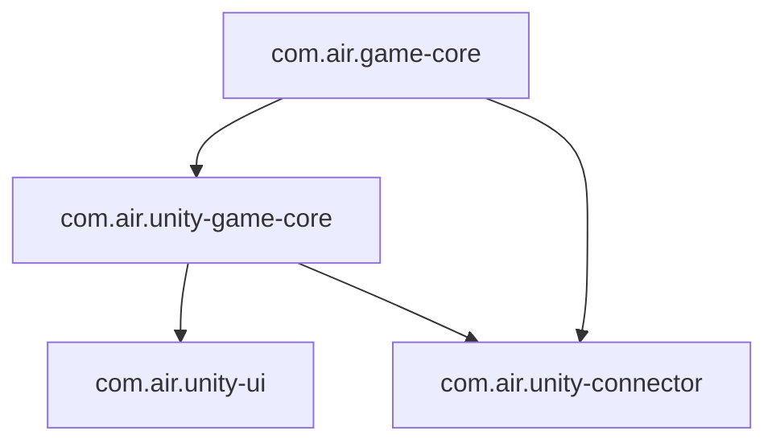

# Package architecture and code ownership

**Last Updated:** 2026-06-02 · **Scope:** Unity UPM package development (Chinese)

Based on each submodule `package.json` and [PACKAGE_CONSTRAINTS.md](PACKAGE_CONSTRAINTS.md).

## Dependency graph

## Layer responsibilities

| Layer | Package | Should contain | Should not contain |
|-------|---------|----------------|---------------------|
| L0 pure C# | `com.air.game-core` | Pool, FSM, Procedure, GoF Command, GF Entity, JSON contracts | Unity, Newtonsoft impl, CLI protocol |
| L1 Unity infra | `com.air.unity-game-core` | `GameRuntime`, EventBus, async resources, Input→CommandHistory, JsonHost, UnityEntityManager, ProcedureManager | UI, concrete CLI commands |
| L2 UI | `com.air.unity-ui` | UIFramework, UIManager | Duplicate EventBus / resource stack |
| L2 CLI | `com.air.unity-connector` | `HttpListenerHost`, Host/Invoke/Job protocol, HTTP routing, main-thread dispatch, CliParam, commands | Protocol duplicated in game-core |

## Ownership quick reference

| Capability | Package |
|------------|---------|
| `HttpListenerHost`, `IRequestDispatcher` | `com.air.unity-connector` |
| `InvokeRegistry`, `InvokeExecutor`, `InvokeCatalog` | `com.air.unity-connector` |
| `JobStateCore`, `InvokeJobRecord` | `com.air.unity-connector` |
| `IEntityManager`, `EntityLogicBase` | `com.air.game-core` |
| `UnityEntityManager`, `UnityEntityInstance` | `com.air.unity-game-core` |
| JsonHost implementation registration | `com.air.unity-game-core` |
| `CliParam*`, Editor/Runtime commands | `com.air.unity-connector` |

## Versions (reference)

| Package | Version |
|---------|---------|
| `com.air.game-core` | 3.0.0 |
| `com.air.unity-game-core` | 4.0.0 |
| `com.air.unity-connector` | 2.0.0 |

C# layout and style: [C_SHARP_STANDARDS.md](C_SHARP_STANDARDS.md).
