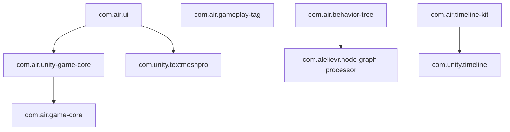

# Air Unity Packages

自用 Unity UPM 包集合，通过 `file:` 路径引用到项目中。

**作者：** [airuxul](https://github.com/airuxul)

## 安装

在项目的 `Packages/manifest.json` 中添加本地路径依赖，例如：

```json
{
  "dependencies": {
    "com.air.game-core": "file:../CustomPackages/com.air.GameCore",
    "com.air.unity-game-core": "file:../CustomPackages/com.air.UnityGameCore",
    "com.air.ui": "file:../CustomPackages/com.air.UI",
    "com.air.gameplay-tag": "file:../CustomPackages/com.air.GameplayTag",
    "com.air.behavior-tree": "file:../CustomPackages/com.air.BehaviorTree",
    "com.air.timeline-kit": "file:../CustomPackages/com.air.TimelineKit",
    "com.alelievr.node-graph-processor": "file:../CustomPackages/com.alelievr.NodeGraphProcessor"
  }
}
```

Unity 会根据各包 `package.json` 中的 `dependencies` 自动解析传递依赖。例如只声明 `com.air.ui` 时会自动拉取 `com.air.unity-game-core` 与 `com.air.game-core`。

## 包一览

| 包名 | 目录 | 说明 |
|------|------|------|
| `com.air.game-core` | [com.air.GameCore](com.air.GameCore) | 纯 C# 基础库（状态机、对象池、单例） |
| `com.air.unity-game-core` | [com.air.UnityGameCore](com.air.UnityGameCore) | 事件、资源、定时器等 Unity 基础框架 |
| `com.air.ui` | [com.air.UI](com.air.UI) | UI 面板、State/Trigger、Editor 代码生成 |
| `com.air.gameplay-tag` | [com.air.GameplayTag](com.air.GameplayTag) | UE4 风格 Gameplay Tag |
| `com.air.behavior-tree` | [com.air.BehaviorTree](com.air.BehaviorTree) | 行为树（基于 Node Graph Processor） |
| `com.air.timeline-kit` | [com.air.TimelineKit](com.air.TimelineKit) | Timeline 扩展与引用导出 |
| `com.alelievr.node-graph-processor` | [com.alelievr.NodeGraphProcessor](com.alelievr.NodeGraphProcessor) | 节点图编辑器（魔改：支持导出到 Runtime） |

## 依赖关系



- **无引擎依赖：** `com.air.game-core` 仅依赖 .NET。
- **可选 UI：** 不需要 UI 时可只装 `com.air.unity-game-core`；TMP 依赖仅在 `com.air.ui` 的 Editor 侧。
- **v2 协作：** 持有 `GameRuntime`，UI 用 `UIFramework.Install(runtime)` 或 `GameEntry.CreateWithUI()`，详见 [PACKAGE_CONSTRAINTS.md](PACKAGE_CONSTRAINTS.md)。
- **行为树链：** `com.air.behavior-tree` → `com.alelievr.node-graph-processor`。

## 文档

| 包 | 文档 |
|----|------|
| Game Core | [README](com.air.GameCore/README.md) |
| Unity Game Core | [README](com.air.UnityGameCore/README.md) |
| Air UI | [README](com.air.UI/README.md) |
| Gameplay Tag | [README](com.air.GameplayTag/README.md) |
| Behavior Tree | [README](com.air.BehaviorTree/README.md) |
| Timeline Kit | [README](com.air.TimelineKit/README.md) |
| Node Graph Processor | [README](com.alelievr.NodeGraphProcessor/README.md) |

## Unity 版本

| 包 | 最低 Unity |
|----|------------|
| Game Core / Unity Game Core / Air UI / Gameplay Tag / Behavior Tree / Node Graph Processor | 2020.3 |
| Timeline Kit | 2021.3 |
