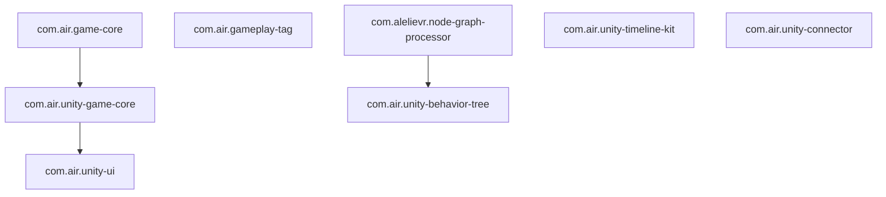

# 包架构与代码归属

基于各子仓 `package.json` 与 [CONSTRAINTS.md](CONSTRAINTS.md)。**代码抽象与重构在各 Submodule 仓库内进行**，元仓只描述边界。

## 依赖关系

## 分层职责（放什么、不放什么）

| 层 | 包 | 应包含 | 不应包含 |
|----|-----|--------|----------|
| L0 纯 C# | `com.air.game-core` | 单例基类、静态对象池、有限状态机 | 任何 `UnityEngine` |
| L1 Unity 基建 | `com.air.unity-game-core` | `GameRuntime`、`EventBus`、资源、定时器、`PoolManager` | UI、玩法域逻辑 |
| L2 UI | `com.air.unity-ui` | `UIFramework`、`UIManager`、`UIScopedEvents` | 自行实现 EventBus / 资源加载 |
| 域 | gameplay-tag / behavior-tree / timeline-kit / unity-connector | 各自领域 API | 随意依赖 unity-game-core |

## 代码归属速查

| 能力 | 包 |
|------|-----|
| 状态机、静态 `ObjectPool<T>`（无 Unity） | `com.air.game-core` |
| `EventBus`、资源、定时器、`UnityObjectPool` | `com.air.unity-game-core` |
| UI 面板、状态、编辑器生成 | `com.air.unity-ui` |
| Gameplay Tag | `com.air.gameplay-tag` |
| 行为树（基于节点图） | `com.air.unity-behavior-tree` |
| Timeline 扩展 | `com.air.unity-timeline-kit` |
| 编辑器/运行时 HTTP 命令 | `com.air.unity-connector`（在 `unity-cli` 子仓） |

## 当前 Submodule 状态（参考）

| 包 | 说明 |
|----|------|
| `com.air.game-core` | L0：Pool、StateMachine（`Initialize` 模式） |
| `com.air.unity-game-core` | L1：GameRuntime、EventBus、资源、定时器、PoolManager |
| `com.air.unity-ui` | L2：UIFramework、GameEntry、UIScopedEvents（已从 v2 单仓恢复） |
| 域包 | gameplay-tag / behavior-tree / timeline-kit 独立，见各包 README |

整理原则：L0→L1→L2 单向依赖；域包不引用 unity-game-core（除非确有需求）。
