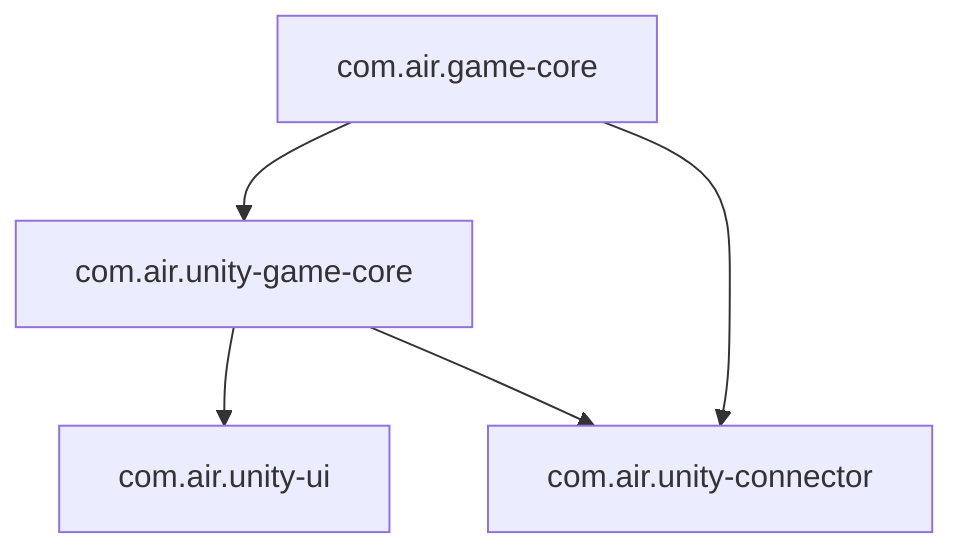

# 包架构与代码归属

基于各子仓 `package.json` 与 [CONSTRAINTS.md](CONSTRAINTS.md)。

## 依赖关系

## 分层职责

| 层 | 包 | 应包含 | 不应包含 |
|----|-----|--------|----------|
| L0 纯 C# | `com.air.game-core` | Pool、FSM、Procedure、GoF Command、GF Entity、JSON 契约 | Unity、Newtonsoft 实现、CLI 协议 |
| L1 Unity 基建 | `com.air.unity-game-core` | `GameRuntime`、EventBus、async 资源、Input→CommandHistory、JsonHost 注册、UnityEntityManager、ProcedureManager | UI、CLI 具体命令 |
| L2 UI | `com.air.unity-ui` | UIFramework、UIManager | 重复 EventBus / 资源 |
| L2 CLI | `com.air.unity-connector` | `HttpListenerHost`、Host/Invoke/Job 协议、HTTP 路由、主线程调度、CliParam、具体命令 | 与 game-core 重复的协议层 |

## 代码归属速查

| 能力 | 包 |
|------|-----|
| `HttpListenerHost`、`IRequestDispatcher` | `com.air.unity-connector` |
| `InvokeRegistry`、`InvokeExecutor`、`InvokeCatalog` | `com.air.unity-connector` |
| `JobStateCore`、`InvokeJobRecord` | `com.air.unity-connector` |
| `IEntityManager`、`EntityLogicBase` | `com.air.game-core` |
| `UnityEntityManager`、`UnityEntityInstance` | `com.air.unity-game-core` |
| `JsonHost` 实现注册 | `com.air.unity-game-core` |
| `CliParam*`、Editor/Runtime 命令 | `com.air.unity-connector` |

## 版本（参考）

| 包 | 版本 |
|----|------|
| `com.air.game-core` | 3.0.0 |
| `com.air.unity-game-core` | 4.0.0 |
| `com.air.unity-connector` | 2.0.0 |

代码风格见 [C_SHARP_STANDARDS.md](C_SHARP_STANDARDS.md)。
