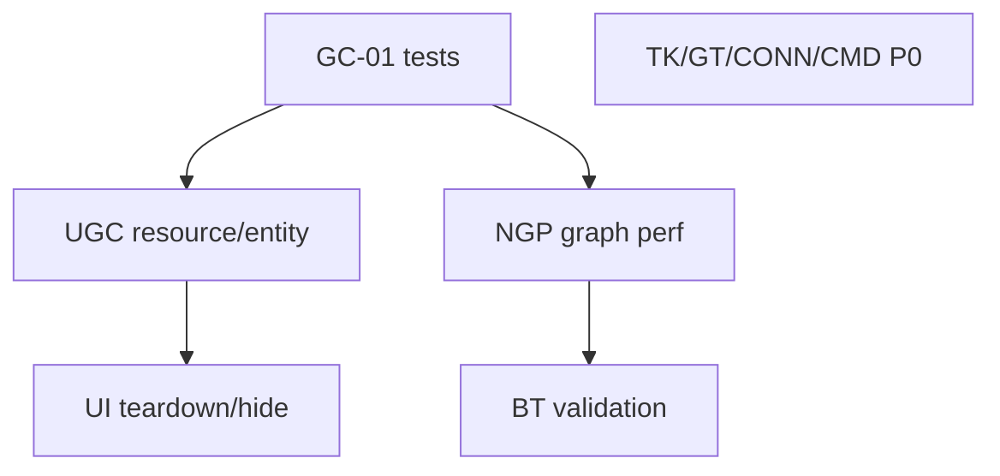

# Cross-package TODO roadmap

**Last Updated:** 2026-06-03 · **Owner:** meta-repo · **Scope:** integrated follow-up backlog from per-package analysis (English)

> **User doc (Chinese):** [../TODO.zh-CN.md](../TODO.zh-CN.md)

This document **coordinates** package-level TODO files. It does not replace them. Each item must be implemented in **one owning package** only.

## Boundary rules (non-negotiable)

| Layer | Package | Owns | Must not own |
|-------|---------|------|----------------|
| L0 | `com.air.game-core` | Pool, FSM/Procedure, GoF undo, entity **logic**, JSON contract | Unity, HTTP, UI, `GameRuntime` |
| L1 | `com.air.unity-game-core` | `GameRuntime`, resources, Unity entities, timers, pools, scene/save/audio glue | UI panels, CLI handlers |
| L2 UI | `com.air.unity-ui` | `UIFramework`, panels, navigator, scoped UI events | Duplicate bus/resources |
| L2 CLI | `com.air.unity-connector` | HTTP invoke, jobs, `CliCommand` catalog | Game composition, UI |
| Domain | gameplay-tag, behavior-tree, timeline-kit, node-graph | Each domain’s public API | Pulling L1 unless already required |
| Tooling | `unity-cmd` | Profiles, catalog cache, CLI dispatch | Unity handler bodies |

When an item touches two packages, split into **consumer** vs **provider** tasks with separate IDs (example: NGP-01 adjacency cache **then** BT-01 validation).

## Per-package TODO files

| Package | Agent (EN) | User (ZH) | Open items (approx.) |
|---------|------------|-----------|----------------------|
| `com.air.game-core` | [docs/TODO.md](../packages/com.air.game-core/docs/TODO.md) | [TODO.zh-CN.md](../packages/com.air.game-core/TODO.zh-CN.md) | 11 |
| `com.air.unity-game-core` | [docs/TODO.md](../packages/com.air.unity-game-core/docs/TODO.md) | [TODO.zh-CN.md](../packages/com.air.unity-game-core/TODO.zh-CN.md) | 15 |
| `com.air.unity-ui` | [docs/TODO.md](../packages/com.air.unity-ui/docs/TODO.md) | [TODO.zh-CN.md](../packages/com.air.unity-ui/TODO.zh-CN.md) | 10 |
| `com.air.gameplay-tag` | [docs/TODO.md](../packages/com.air.gameplay-tag/docs/TODO.md) | [TODO.zh-CN.md](../packages/com.air.gameplay-tag/TODO.zh-CN.md) | 10 |
| `com.air.unity-behavior-tree` | [docs/TODO.md](../packages/com.air.unity-behavior-tree/docs/TODO.md) | [TODO.zh-CN.md](../packages/com.air.unity-behavior-tree/TODO.zh-CN.md) | 9 |
| `com.alelievr.node-graph-processor` | [docs/TODO.md](../packages/com.alelievr.node-graph-processor/docs/TODO.md) | [TODO.zh-CN.md](../packages/com.alelievr.node-graph-processor/TODO.zh-CN.md) | 9 |
| `com.air.unity-timeline-kit` | [docs/TODO.md](../packages/com.air.unity-timeline-kit/docs/TODO.md) | [TODO.zh-CN.md](../packages/com.air.unity-timeline-kit/TODO.zh-CN.md) | 9 |
| `unity-cli` (connector + cmd) | [docs/TODO.md](../packages/unity-cli/docs/TODO.md) | [TODO.zh-CN.md](../packages/unity-cli/TODO.zh-CN.md) | 12 |

## Integrated P0 backlog (start here)

Ordered for **dependency and blast radius**. Do not skip boundary column.

| Order | ID | Package | Title | Why first | Do not implement in |
|-------|-----|---------|-------|-----------|---------------------|
| 1 | GC-01 | game-core | L0 unit tests | Unblocks safe L1 refactors | unity-game-core |
| 2 | UGC-01–03 | unity-game-core | Resource + entity lifecycle | Leaks affect UI and gameplay | unity-ui (only call APIs) |
| 3 | UI-01–02 | unity-ui | Uninstall teardown + Hide vs destroy | User-visible leaks / broken stack | unity-game-core |
| 4 | NGP-01–02 | node-graph-processor | RuntimeGraph perf | BT and exports depend on it | behavior-tree |
| 5 | BT-01–02 | behavior-tree | Validation + smoke tests | Domain correctness on NGP | NGP |
| 6 | TK-01–02 | timeline-kit | Preload key + manifest guard | Sample correctness | unity-game-core |
| 7 | GT-01–02 | gameplay-tag | Rename unsaved + propagation | Data integrity independent of stack | any Air core package |
| 8 | CONN-01 | unity-connector | Profiler arg fix | Agent automation reliability | unity-cmd |
| 9 | CMD-01 | unity-cmd | Submodule / CI completeness | Meta agent workflow | connector |

## Integrated P1 themes (parallel tracks)

| Theme | IDs | Owner | Notes |
|-------|-----|-------|-------|
| **Runtime lifecycle** | UGC-04–09, UI-03–05 | unity-game-core, unity-ui | UI consumes `IResManager`; no new loader in UI |
| **Entity/pool integration** | UGC-06, GC-02–04 | unity-game-core, game-core | Pool **registry** is L1; entity **rules** stay L0 |
| **Procedure/scene** | UGC-07–08, UGC-13 | unity-game-core | Procedures defined in game-core; tick host in L1 |
| **Graph platform** | NGP-03–05, BT-03–06 | NGP then BT | Export strictness before new BT nodes |
| **Tag tooling** | GT-03–07 | gameplay-tag | Standalone; games subscribe via components |
| **Automation** | CONN-02–04, CMD-02–04 | unity-cli repo | Version/build lockstep is cross-artifact |

## Sequencing phases

**Phase A — Foundation:** GC-01, UGC-01–03, NGP-01–02.  
**Phase B — User-visible stability:** UI-01–04, UGC-07–09, GT-01–02.  
**Phase C — Domain depth:** BT-*, TK-*, GT-*, CONN/CMD.  
**Phase D — Polish/docs:** P2/P3 items per package TODO files.

## Anti-patterns (reject in review)

| Proposed change | Correct owner |
|-----------------|---------------|
| Move HTTP listener into game-core | `com.air.unity-connector` only |
| Add `GameRuntime` fields for UI panels | `com.air.unity-ui` + inject `IGameRuntime` |
| Implement Newtonsoft in game-core | `com.air.unity-game-core` bootstrap |
| Put Sequence/Selector nodes in NGP | `com.air.unity-behavior-tree` |
| Timeline preload inside `SceneFlow` | timeline-kit loader injection at game layer |
| Duplicate `EventBus` for UI-only events | `UIScopedEvents` on `Runtime.Events` |
| Catalog commands in README tables | Live `POST /list` + unity-cmd cache |

## Meta-repo maintenance

| Action | When |
|--------|------|
| Update package `docs/TODO.md` + `TODO.zh-CN.md` | Item opened/closed/completed in that submodule (keep IDs in sync) |
| Update this file **Integrated P0** / theme tables | Priority or cross-package order changes |
| Bump **Last Updated** on touched files | Any edit |
| Run `unity-compile-loop.ps1` | After `packages/**/*.cs` changes per `.cursor/rules` |

## Analysis source

Per-package lists were produced by scoped codebase review (2026-06-03) against README, `DESIGN.md`, `IMPLEMENTATION.md`, and Runtime sources. Sparse submodule checkouts should run `git submodule update --init` before implementation.
